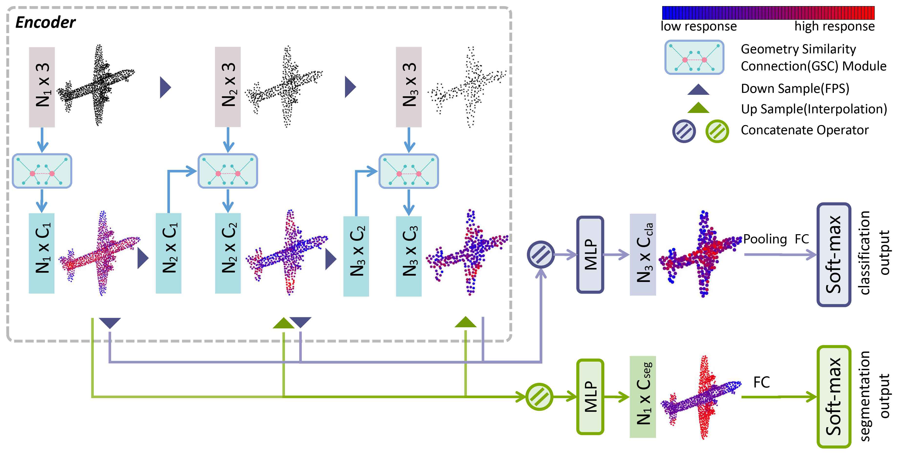

# Geometry Sharing Network for 3D Point Cloud Classification and Segmentation. AAAI 2020
Mingye Xu, Zhipeng Zhou, Yu Qiao.

## Overview



Futher information please contact Mingye Xu (my.xu@siat.ac.cn)

## Citation
Please cite this paper if you want to use it in your work,

    @misc{xu2019geometry,
        title={Geometry Sharing Network for 3D Point Cloud Classification and Segmentation},
        author={Mingye Xu and Zhipeng Zhou and Yu Qiao},
        year={2019},
        eprint={1912.10644},
        archivePrefix={arXiv},
        primaryClass={cs.CV}
    }


## Installation


### Requirements
* Linux (tested on Ubuntu 14.04/16.04)
* Python 3.5+
* PyTorch 1.0

### Install 
Install this library by running the following command:

```shell
cd OP
python setup.py install
cd ../
```

## Usage

### Point Cloud Classification
* Run the training script:

``` 
python main.py 
```

* Run the evaluation script :
```
python main.py --eval True --model_path 'pretrained/model_1024_92.9.t7'
```

## Other information
We will release part segmentation code later. Due to the differences of models, please contact us by email if you need the classification model(2048 input points) with 93.3% accuracy.

## Acknowledgement
This code is based on [DGCNN](https://github.com/WangYueFt/dgcnn) and [Pointnet2.Pytorch](https://github.com/erikwijmans/Pointnet2_PyTorch).  
